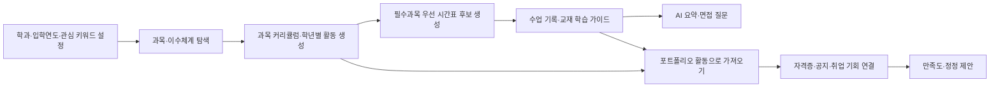
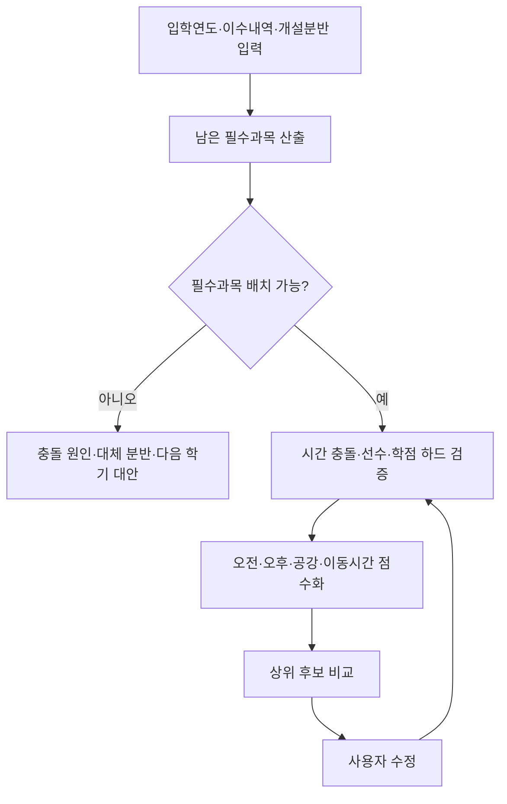
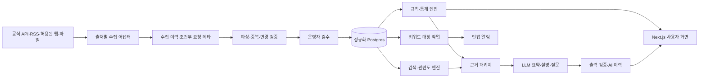
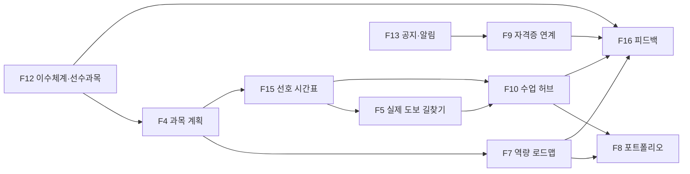

# 수강길잡이 V2 확장 PRD

**목차**

1. 문서 정보
2. 개요
3. 배경 및 문제 정의
4. 목표와 성공 지표
5. 타겟 사용자와 핵심 여정
6. 현재 프로그램 적합성 및 개선 판단
7. 핵심 기능 요약
8. 상세 기능 명세 (F5~F16)
9. 공통 AI 및 신뢰 원칙
10. 데이터 요구사항
11. 기술 스택 및 아키텍처
12. 정보 구조와 화면 연결
13. 데이터 수집·알림·운영 정책
14. 개인정보·보안·저작권
15. 관리자 기능 요구사항
16. 구현 우선순위 및 개발 로드맵
17. 프로젝트 완료 기준

---

## 1. 문서 정보

| 항목 | 내용 |
| --- | --- |
| 문서명 | 수강길잡이 V2 확장 Product Requirements Document |
| 버전 | v2.0 (전면 재작성) |
| 작성일 | 2026-08-24 |
| 상태 | Draft - 데이터·권한 검토 필요 |
| 서비스명 | 수강길잡이 |
| 대상 독자 | 기획·디자인·개발·운영 담당자, 학교·학과 이해관계자 |
| 기준 문서 | `docs/PRD.md` |
| 구현 현황 문서 | `docs/SPRINT_PLAN_V2.md`, `docs/FEATURE_SUMMARY.md` |

> 이 문서는 `docs/PRD.md`의 F1~F4와 `docs/FEATURE_SUMMARY.md`의 F5를 폐기하지 않고 확장한다.
> 기존 과목 검색, 수강평 요약, 산업·진로 검색, 과목 커리큘럼, 시간표·이동동선은 계속 유지한다. 이 문서는 회의에서 추가된
> F5의 실제 길찾기 보강과 F6~F16을 구현 여부와 관계없이 다시 정의한 규범 요구사항이다. 완료 여부는 PRD 체크박스가 아니라
> 스프린트 문서에서만 관리한다.

---

## 2. 개요 (Executive Summary)

수강길잡이 V2는 기존의 과목 탐색·수강 계획 서비스를 다음의 연속된 학생 성장 경험으로 확장한다.

`과목 탐색 → 공식 학사규칙 확인 → 학기별 계획 → 시간표 실행 → 학습 기록 → 역량·포트폴리오 → 자격증·취업 기회`

사용자는 관심 키워드와 학과·입학연도·이수 내역을 바탕으로 과목 및 학년별 활동을 추천받고, 오전·오후·공강
선호를 반영한 시간표를 만들며, 실제 수업 기록을 AI 요약과 면접 질문으로 전환할 수 있다. 커리큘럼에서 계획한
활동은 포트폴리오로 이어지고, 학교·학과 공지와 자격증·취업 정보는 저장한 키워드에 맞춰 연결된다.

V2의 핵심 개선은 기능 수가 아니라 **신뢰 가능한 연결**이다. 졸업요건, 선수과목, 수강 인원, 시간 충돌처럼
정답이 있는 사실은 공식 데이터와 규칙 엔진이 처리하고, AI는 검색 확장, 순위화, 요약, 추천 이유, 면접 질문처럼
언어적 판단이 필요한 부분만 담당한다. 모든 추천에는 출처·적용 연도·검증 상태·생성 근거를 표시한다.

---

## 3. 배경 및 문제 정의

### 3.1 현황

현재 수강 정보, 이수체계, 비교과 활동, 자격증, 학교 공지, 취업 정보는 서로 다른 사이트와 문서에 흩어져 있다.
학생은 과목을 선택한 뒤에도 그 과목이 진로 역량과 어떻게 연결되는지, 학년별로 어떤 활동을 준비해야 하는지,
그 결과를 포트폴리오와 면접에서 어떻게 설명할지 스스로 조합해야 한다. 공지 확인도 학생의 반복 방문에 의존해
마감이 짧은 기회를 놓치기 쉽다.

### 3.2 Pain Points

| ID | 문제 | 상세 |
| --- | --- | --- |
| P5 | 수강 수요의 맥락 부족 | 학기별 수강 인원은 볼 수 있어도 분반 수·정원 변화와 함께 해석하기 어렵다. |
| P6 | 학과 교육과 진로 역량의 단절 | 어떤 과목과 활동이 학과별 AI 활용 역량 및 희망 분야에 필요한지 한 흐름으로 계획하기 어렵다. |
| P7 | 계획과 성과 기록의 단절 | 커리큘럼에서 추천받은 활동을 포트폴리오 성과로 이어서 관리할 수 없다. |
| P8 | 학습 기록의 휘발 | 시간표를 만든 뒤 강의 목표·과제·시험·배운 내용을 구조화하거나 면접 근거로 전환하기 어렵다. |
| P9 | 공식 학사규칙 부족 | 입학연도별 이수체계, 선수·동시수강, 예외 규칙이 추천과 시간표에 충분히 반영되지 않는다. |
| P10 | 기회 정보의 분산 | 학교·학과 공지, 자격증 교육, 취업 공고를 각각 찾아야 하며 관심 키워드 공지를 놓치기 쉽다. |
| P11 | 외부 자료의 신뢰·권한 불명확 | 자격증, 학습 사이트, 선배 자기소개서, 취업 후기는 출처·최신성·재사용 권한이 다르다. |
| P12 | AI 추천의 설명 부족 | 추천 이유, 사용한 데이터, 확신 수준, 최신성이 보이지 않으면 사용자가 결과를 검증하기 어렵다. |
| P13 | 피드백의 운영 연결 부족 | 만족도와 오류 제안이 데이터 버전에 연결되지 않으면 추천 품질 개선에 사용할 수 없다. |

---

## 4. 목표와 성공 지표

### 4.1 제품 목표

- 과목 탐색부터 취업 준비까지 사용자의 계획과 근거가 끊기지 않도록 연결한다.
- 학과·입학연도별 공식 학사규칙을 바탕으로 실행 가능한 커리큘럼과 시간표를 만든다.
- AI가 만든 제안과 공식 사실을 명확히 구분하고, 사용자가 결과를 수정·재생성·평가할 수 있게 한다.
- 허용된 학교·학과·자격증·취업 정보를 수집해 최신 기회를 한곳에서 제공한다.
- 사용자 활동과 수업 기록을 재사용 가능한 포트폴리오 및 면접 근거로 축적한다.

### 4.2 사용자 목표

- 특정 과목의 연도·학기별 수강 규모와 변화 맥락을 빠르게 파악하고 싶다.
- 내 학과와 희망 분야에 맞는 과목, 프로젝트, 비교과, 자격증 준비 활동을 학년별로 알고 싶다.
- 오전·오후·공강 선호를 반영하되 남은 필수과목을 빠뜨리지 않는 시간표를 만들고 싶다.
- 실제 수업에서 배운 내용을 수정 가능한 요약과 면접 질문으로 정리하고 싶다.
- 관심 키워드가 포함된 공지와 취업 기회를 놓치지 않고 싶다.
- 추천이 왜 나왔는지, 어떤 출처를 사용했는지 직접 확인하고 싶다.

### 4.3 성공 지표

아래 목표치는 로컬 시연 데이터와 사용자 테스트 기준선을 측정한 뒤 확정한다.

| 지표 | 산식 | 제안 목표 |
| --- | --- | --- |
| 학사 하드 제약 위반률 | 확정 계획 중 필수·선수·학점·시간 충돌 위반 계획 수 / 전체 확정 계획 수 | 0% |
| 출처 표시율 | 공식 사실을 사용하는 화면 중 출처·적용 기간·갱신일을 모두 표시한 화면 비율 | 100% |
| 추천 근거 충족률 | 추천 항목 중 이유·근거·신뢰 상태를 모두 제공한 항목 비율 | 100% |
| 커리큘럼 생성 성공률 | 유효 입력 중 검증 가능한 계획을 반환한 요청 비율 | 95% 이상 |
| 추천 만족도 | 정확성·유용성·설명 가능성 5점 척도 평균 | 각 4.0 이상 |
| 공지 동기화 완전성 | 수동 동기화 성공 후 지원 출처의 신규 공지를 누락 없이 반영한 비율 | 100% |
| 키워드 알림 정밀도 | 사용자가 관련 있다고 평가한 알림 / 평가된 전체 알림 | 90% 이상 |
| 포트폴리오 연결 성공률 | 선택한 커리큘럼 활동을 포트폴리오로 오류 없이 가져온 비율 | 100% |
| AI 근거 일치율 | 표본 검수에서 생성 문장이 연결된 입력·출처로 뒷받침되는 비율 | 98% 이상 |

### 4.4 Non-goals

- 학교 수강신청 시스템을 대체하거나 자동으로 수강신청하지 않는다.
- 학점 취득, 졸업 가능, 자격증 합격, 취업 성공을 보장하지 않는다.
- 공식 근거 없이 자격증을 필수 요건으로 단정하지 않는다.
- 이용 허가가 없는 자기소개서·교재·유료 콘텐츠 원문을 복제하거나 재배포하지 않는다.
- 자유 익명 게시판을 초기 범위에 포함하지 않는다. 먼저 구조화된 만족도·정정 제안으로 운영 부담을 검증한다.
- 공지·채용 원문 사이트를 대체하지 않으며, 지원·신청은 공식 원문에서 진행한다.

---

## 5. 타겟 사용자와 핵심 여정

### 5.1 페르소나 A - 저학년 탐색형

학과 공부와 AI를 어떻게 연결할지 아직 모른다. 관심 키워드로 관련 과목과 학년별 입문 활동을 찾고, 향후
포트폴리오에 남길 수 있는 작은 프로젝트부터 시작하고 싶다.

### 5.2 페르소나 B - 학업 계획형

입학연도별 졸업요건과 선수과목을 지키면서 남은 학기를 계획하고 싶다. 오전·오후·공강 선호도 중요하지만
전공필수는 누락하지 않기를 원한다.

### 5.3 페르소나 C - 취업 준비형

수업·프로젝트 경험을 직무 역량과 면접 답변으로 정리하고, 관련 자격증·교육·취업 공고와 선배 사례를 찾고 싶다.

### 5.4 페르소나 D - 반복 정보 확인형

학교와 학과 사이트를 매일 확인하기 어렵다. 자격증, 어학연수, 장학금, 채용 등 관심 키워드를 저장하고 새 공지가
올라올 때만 확인하고 싶다.

### 5.5 페르소나 E - 학과·서비스 운영자

교육과정, 선수과목, 공지 출처, AI 분류와 사용자 정정 제안을 검수하고 잘못된 정보를 빠르게 수정해야 한다.

### 5.6 핵심 사용자 여정

---

## 6. 현재 프로그램 적합성 및 개선 판단

### 6.1 종합 판단

현재 Next.js App Router, React, Neon Postgres, Drizzle ORM, OpenAI 연동 구조는 회의 범위를 수용할 수 있다.
프런트엔드를 새로 만드는 것보다 **학사 원장 정규화, 사용자 데이터의 계정 저장, 외부 데이터 수집·권한 관리,
AI 생성 이력과 출처 관리**를 보강하는 것이 우선이다.

현재 상태를 그대로 확장하면 과목·학기·분반이 한 테이블에 섞이고, 선수과목은 JSON 배열이며, 일부 기능은
`localStorage`에만 저장되는 한계가 누적된다. 따라서 이 PRD는 기존 코드를 폐기하지 않되 사실 데이터,
추천 로직, 사용자 산출물, 외부 콘텐츠를 분리하는 방향을 채택한다.

### 6.2 요구사항별 현재 지원 수준

| 요구사항 | 현재 수준 | 근거 | 필요한 변경 |
| --- | --- | --- | --- |
| 연도·학기별 수강 인원 | 부분 지원 | `courses.enrolledCount`, `lib/enrollment/trend.ts`, 과목 상세 차트 | 과거 학기 확대, 출처·수집시각, 과목 코드 변경 이력, 결측 표시 |
| 학과별 AI 역량·학년별 활동 | 부분 지원 | `lib/ai/capability-activities.ts`, `components/curriculum-planner.tsx` | 공식 과목·역량 근거, 전 학과 확대, 계정 저장·버전 관리 |
| 키워드에서 커리큘럼 연결 | 부분 지원 | 검색과 `careerKeyword` 입력은 존재 | 검색 결과를 계획 후보로 전달하고 키워드를 과목 순위에도 실제 반영 |
| 포트폴리오 빌더 | 시제품 | `components/portfolio-builder.tsx`, `lib/portfolio/*` | 커리큘럼 옆 작업창, DB 저장, 증빙·내보내기 |
| 자격증 추천·교육 공지 | 미지원 | AI 활동의 일반 제안만 존재 | 공식 자격증 원장, 근거 등급, 공지 연결 |
| 시간표 기반 수업 요약·면접 질문 | 시제품 | `components/study-hub.tsx`, `lib/actions/study.ts` | DB 저장, AI 원본·수정본 분리, 버전·근거 이력 |
| 교재 기반 학습 가이드 | 미지원 | 관련 엔티티·화면 없음 | 판본·ISBN·허용 자료·검증 링크 모델 신설 |
| 학과별 이수체계·선수과목 | 부분 지원 | `curricula`, `prerequisiteCodes`, 관리자 편집 | 입학연도별 관계형 규칙, 공식 출처, 시각화, 예외·동시수강 |
| 학교·학과 공지와 최근 N개 | 미지원 | 수집기·스키마·화면 없음 | 허용 출처 수집, 중복·수정 감지, 최신 목록 |
| 키워드 알림 | 미지원 | 구독·매칭·알림 모델 없음 | 계정 구독, 매칭 작업, 인앱 알림, 수신 동의 |
| 취업 공고 | 미지원 | 관련 도메인 없음 | 허용 API·피드, 만료·마감·필터 관리 |
| 자기소개서·취업성공후기 | 미지원 | 관련 도메인 없음 | 재사용 권한 확인, 링크 우선, 비식별화·삭제 절차 |
| 오전·오후·공강 시간표 | 부분 지원 | `lib/timetable/preferences.ts`, 분반 후보 UI | 남은 필수과목 자동 선택, 전체 후보 탐색, 충돌 대안 |
| 만족도·커뮤니티 의견 | 시제품 | 커리큘럼 만족도 `localStorage` 저장 | 서버 집계, 추천 버전 연결, 구조화된 정정·처리 상태 |

### 6.3 채택하는 개선 방식

1. **공식 사실 계층**: 과목, 개설 분반, 수강 인원, 이수체계, 선수과목, 자격증, 공지를 출처·적용 기간과 함께 저장한다.
2. **규칙·통계 계층**: 졸업요건, 선수과목, 학점, 시간 충돌, 수강 인원 합계는 결정론적으로 계산한다.
3. **AI 제안 계층**: 검색 확장, 활동 추천, 설명, 요약, 면접 질문은 검증된 입력만 사용해 생성한다.
4. **사용자 산출물 계층**: 계획, 시간표, 수업 기록, 포트폴리오, 피드백을 계정 단위로 저장하고 버전을 분리한다.
5. **외부 콘텐츠 계층**: 공지·채용·후기는 요청 처리와 분리된 수집 작업으로 가져오며 권한과 변경 이력을 관리한다.

> 수강 인원 합계와 증감은 AI가 계산하지 않는다. 코드가 구조화된 통계 사실을 만들고 AI는 그 사실만
> 문장화한다. AI가 실패하거나 검증을 통과하지 못하면 동일한 사실을 규칙 기반 문장으로 제공한다.

### 6.4 현재 구현에서 먼저 해소할 구체적 제약

- 현재 수강 인원 원본은 저장소 기준 2026-1·2026-2 두 학기에 한정되어 장기 추세 판단에 부족하다.
- 커리큘럼 데이터는 전자공학부·컴퓨터인공지능학부 중심이며, 조회도 사용자의 입학연도를 받기보다 최신
  교육과정을 선택한다. 선수과목 관계는 일부 예시 데이터이므로 공식 규칙처럼 제공할 수 없다.
- 자유 `careerKeyword`는 학년별 활동 문구에는 쓰이지만 과목 후보와 배치 순위에는 직접 반영되지 않는다.
- 현재 시간표 후보 생성은 사용자가 장바구니에 넣은 과목의 분반 조합을 바꾸는 수준이다. 남은 필수과목을
  교육과정에서 찾아 자동으로 포함하지 않으며 탐색 조합 수에도 상한이 있다.
- 포트폴리오, 수업 기록, 일부 커리큘럼 저장, 만족도는 브라우저 `localStorage` 기반이라 계정 동기화,
  버전 복원, 운영 집계에 사용할 수 없다.
- 공지·자격증·취업 공고·취업 사례는 엔티티, 수집기, 변경 감지, 알림 전달 경로가 모두 새로 필요하다.
- 개인 산출물을 서버에 저장하기 전 현재 인증을 만료·폐기·회전 가능한 서버 세션으로 보강해야 한다.

따라서 **현재 프로그램은 회의 내용을 담을 수 있으나 그대로 기능만 추가해서는 신뢰 가능한 V2가 되지 않는다.**
Phase 0에서 데이터·권한을 확인하고 Phase 1에서 학사 데이터와 계정 저장 기반을 먼저 바꾸는 것을 구현 전제로 한다.

---

## 7. 핵심 기능 요약

| ID | 기능명 | 설명 | 우선순위 | 선행 조건 |
| --- | --- | --- | --- | --- |
| F5 | 앱 내부 실제 도보 이동동선 | TMAP 보행 경로를 시간표 지도 안에 표시하고 연속 수업 구간의 거리·시간을 계산 | **P0 최우선** | 건물 출입구 좌표, TMAP appKey·보행 API |
| F6 | 검증형 AI 수강 추세 요약 | 연도·학기·분반별 수강 규모를 집계하고 검증된 사실만 AI로 요약 | P1 | 과거 개설·수강 데이터 |
| F7 | AI 역량 로드맵 | F4 과목 계획에 학과·학년·관심 키워드별 역량과 활동을 연결 | P0 | F12, 기존 F3·F4 |
| F8 | 포트폴리오 빌더 | 커리큘럼·수업 활동을 성과 기록으로 전환 | P1 | F7, 계정 저장 |
| F9 | 자격증 추천·교육 연계 | 분야별 자격증과 관련 교내 교육 공지를 공식 근거로 연결 | P1 | F13, 자격증 원장 |
| F10 | 수업 허브 | 학기별 수업 기록, 수정 가능한 AI 요약, 면접 질문 생성 | P1 | 기존 F5, 계정 저장 |
| F11 | 교재 학습 가이드 | 교재 판본과 강의 자료에 근거한 학습 순서·참고 사이트 제공 | P2 | 강의계획서·교재 정보 |
| F12 | 이수체계·선수과목 | 입학연도별 이수체계 시각화와 계획 검증 | P0 | 공식 학사 데이터 |
| F13 | 공지·채용·키워드 알림 | 최근 N개 공지, 취업 공고, 저장 키워드 인앱 알림 | P1 | 수집 허용·스케줄러 |
| F14 | 취업 사례·허용 자료 | 취업성공후기와 권한이 확인된 자기소개서 자료 연결 | P2 | 재사용 권한·비식별화 |
| F15 | 선호 시간표 생성 | 필수과목을 우선하고 오전·오후·공강 선호를 최적화 | P0 | F12, 실제 개설 분반 |
| F16 | 추천 품질 피드백 | 만족도, 정정 제안, 커뮤니티 의견과 처리 결과 관리 | P1 | 계정·운영자 워크플로 |

> P0: 신뢰 가능한 학업 계획의 필수 기능 / P1: 핵심 확장 기능 / P2: 데이터·권한 확보 후 확장 기능

### 7.1 기존 기능과의 관계

| 기존 기능 | V2 연결 |
| --- | --- |
| F1 수강평 해시태그·AI 요약 | F6의 수강 추세와 함께 과목 상세의 의사결정 근거로 제공 |
| F2 학문 분야 검색 | F7 커리큘럼 진입점 및 교재·학습 자료 탐색에 활용 |
| F3 산업·진로 검색 | F7 활동, F9 자격증, F13 취업 공고의 공통 관심 분야로 사용 |
| F4 과목 커리큘럼 | 졸업요건을 지키는 과목 계획의 소유 기능. F7 역량 활동, F8 포트폴리오, F15 시간표의 학기 계획 원본 |
| F5 시간표·이동동선 | TMAP 앱 내부 도보 경로만 제공하고 실패 시 다른 지도 공급자로 전환하지 않는다. F10 수업 허브 및 F15 후보 비교의 현재 학기 실행 화면으로 사용 |

---

## 8. 상세 기능 명세

### 8.0 F5. TMAP 앱 내부 실제 도보 길찾기

**배경**

기존 시간표 지도는 건물 좌표 사이의 직선과 직선거리 기반 이동시간을 보여주므로 실제 출입구, 보행로,
횡단보도와 통행 제한을 반영하지 못한다. 직선을 실제 경로처럼 표시하면 사용자가 다음 수업까지 이동 가능성을
잘못 판단할 수 있다. 외부 지도 앱으로 전환하는 폴백도 사용자가 수강길잡이 화면을 벗어나게 하고 공급자 경험을
혼합하므로, 목표 경험은 TMAP 앱 내부 경로와 명확한 추정 상태만으로 구성한다.

> 현재 구현 상태: TMAP 서버 경로 계산, 앱 내부 경로선·거리·시간, 부분 실패, 요청 취소와 23시간 프로세스 캐시를
> 구현했다. 출입구 수동 검수, 공개 Vector 지도 키 정책과 운영 쿼터 계측은 남아 있다.

**사용자 스토리**

- 학생으로서, 다른 지도 앱으로 이동하지 않고 시간표 화면에서 다음 수업까지의 실제 보행 경로를 보고 싶다.
- 학생으로서, 각 이동 구간과 하루 전체의 도보 거리·예상 시간을 확인하고 싶다.
- 학생으로서, 경로를 계산할 수 없을 때 실제 경로가 없음을 알고 추정값을 명확히 구분하고 싶다.

**기능 요구사항**

1. 시간표의 이동동선 화면은 TMAP Vector JS 지도에 수업 순서별 건물 출입구 핀과 실제 보행 경로선을 함께 표시한다.
2. 같은 캠퍼스의 연속 수업 두 지점은 TMAP 보행자 경로 REST API의 `WGS84GEO` 좌표로 계산한다. 응답의
   `LineString`, 총 거리, 총 시간을 각각 경로선, `n m`, `도보 n분`으로 표시한다.
3. 브라우저가 TMAP 보행 REST API를 직접 호출하지 않는다. Next.js 서버 경로가 알려진 건물 ID를 좌표로 변환하고,
   캠퍼스 범위·요청 개수·빈도를 검증한 뒤 TMAP에 요청한다. 임의 좌표나 임의 외부 URL은 받지 않는다.
4. TMAP Vector JS 로더에 필요한 appKey는 브라우저에 노출될 수 있음을 전제로 사용량을 감시한다. REST 호출은
   서버를 통하고 오류 응답과 필요한 GeoJSON·거리·시간만 클라이언트에 전달한다.
5. 하루 동선은 연속 수업 구간을 각각 계산하고 지도에서 구간 순서를 구분한다. 하루 전체 거리·시간은 성공한
   모든 구간의 값을 코드로 합산하며, 일부 구간 실패를 전체 성공값처럼 표시하지 않는다.
6. 경로 요청 중에는 지도 크기를 바꾸지 않는 로딩 상태를 표시한다. 요일·시간표가 바뀌면 이전 요청을 취소하거나
   결과를 폐기해 다른 요일의 경로가 섞이지 않게 한다.
7. [TMAP 이용약관](https://tmapapi.tmapmobility.com/terms.html)에 따라 경로 geometry는 DB에 영구 저장하지 않는다.
   같은 출입구 쌍의 반복 요청을 줄이기 위한 캐시는 최대 24시간으로 제한하고 출발·도착 좌표, 검색 옵션,
   공급자 버전을 캐시 키에 포함한다.
8. TMAP 지도 또는 보행 경로가 실패하면 실제 경로선을 만들지 않는다. 직선거리 추정값에는 `추정`을 표시하고,
   다른 지도 SDK나 외부 지도 앱으로 전환하지 않는다.
9. 실제 보행 경로 화면은 TMAP 지도와 TMAP 경로만 함께 사용한다. TMAP geometry를 다른 공급자 바탕지도에
   겹쳐 표시하거나 다른 공급자의 경로와 합치지 않는다.
10. 건물 좌표는 학교 공식 시설 데이터, 공공데이터 또는 직접 검수한 출입구 좌표를 사용하고 출처·검수일을 기록한다.
11. 구현 전에 전북대 전주캠퍼스 대표 출입구 쌍 5~10개를 실제 호출해 지원 여부, 보행로 스냅 위치, 거리·시간
    품질을 검증한다. 지원되지 않거나 품질이 낮으면 자체 캠퍼스 보행 그래프 또는 OpenStreetMap 기반 공급자를 재검토한다.
12. [TMAP 공식 요금표](https://openapi.sk.com/products/calc?menuSeq=5&svcSeq=4)의 2026-08-24 기준 Free 한도인
    경로안내 1,000건/일과 지도보기 100,000건/일 안에서 동작하도록 구간 호출 수와 일일 사용량을 표시한다.
13. 이 기능은 경로 미리보기다. 실시간 위치 추적, 음성 안내, 경로 이탈 감지, 자동 재탐색은 범위에 포함하지 않는다.

**Edge Case**

- 서로 다른 캠퍼스 사이 구간에는 도보 길찾기를 제공하지 않고 캠퍼스 간 이동 경고를 유지한다.
- 같은 건물의 연속 수업은 하나의 정류지로 합치며 불필요한 길찾기 링크를 만들지 않는다.
- TMAP이 시작점을 가까운 자동차 도로로 스냅하거나 경로 없음으로 반환하면 실제값을 숨기고 좌표 검수 상태를 표시한다.
- 출입구 좌표가 같거나 누락된 구간은 API를 호출하지 않고 해당 건물의 좌표 확인이 필요하다고 표시한다.
- 여러 구간 중 하나만 실패하면 성공 구간은 유지하되 하루 총합을 완전한 값처럼 표시하지 않는다.
- TMAP appKey 미설정·일일 한도 초과·timeout·네트워크 실패를 구분하되 공급자 원문 오류나 키를 화면에 노출하지 않는다.
- TMAP 실패 상태는 지도 영역의 크기를 유지하고 실제 경로가 없는 건물 순서·추정 안내로만 전환한다.
- 건물 중심점과 실제 출입구가 다르면 경로 품질이 떨어지므로 관리자가 좌표를 정정할 수 있어야 한다.

**완료 조건**

- [ ] 데스크톱과 모바일 시간표 화면 안에서 연속 수업별 TMAP 보행 경로선·거리·시간이 표시된다.
- [ ] 하루 전체 값은 성공한 구간별 거리·시간 합계와 일치하고 부분 실패 상태가 구분된다.
- [ ] 전북대 대표 출입구 쌍 5~10개가 실제 보행로와 합리적인 스냅 위치를 사용하는지 수동 검증한다.
- [ ] TMAP REST 요청은 서버에서 허용된 건물과 캠퍼스 범위만 처리한다. Vector JS용 appKey의 브라우저 노출은
      명시하되 REST 요청 헤더·공급자 원문 오류·추가 비밀값은 응답이나 로그에 노출하지 않는다.
- [ ] 동일 경로 캐시는 24시간 이내이며 geometry를 DB에 영구 저장하지 않는다.
- [ ] 로딩·요일 전환·경로 없음·한도 초과·네트워크 실패 상태에서 이전 또는 가짜 경로가 남지 않는다.
- [ ] TMAP 실패 시 직선거리 값은 `추정`으로 표시되고 다른 지도 공급자의 SDK·경로·앱 링크가 렌더링되지 않는다.
- [ ] 자동차 경로를 도보 경로로 표시하지 않고, TMAP 경로를 다른 사업자의 바탕지도에 무단 결합하지 않는다.

### 8.1 F6. 연도·학기별 수강 인원 및 검증형 AI 추세 요약

**배경**

단일 학기의 수강 인원만으로는 과목의 꾸준한 수요, 분반 확대, 정원 변화, 일시적 변동을 구분하기 어렵다.

**사용자 스토리**

- 학생으로서, 관심 과목을 연도·학기별로 몇 명이 수강했는지 숫자와 추세로 보고 싶다.
- 학생으로서, 분반 수나 정원 변화 때문에 수강 인원이 달라졌는지 함께 판단하고 싶다.

**기능 요구사항**

1. 동일 학수번호의 같은 연도·학기 분반을 합산해 `수강 인원 합계`, `정원 합계`, `분반 수`를 계산한다.
2. 학수번호가 변경되거나 교과목이 통합·분리된 경우 운영자가 설정한 과목 계보가 있을 때만 추세를 연결한다.
3. 학기별 숫자, 정원 대비 충원율, 전 학기·전년 동기 대비 증감을 차트와 표로 제공한다.
4. 결측 분반 또는 수강 인원 미공개 학기는 0명으로 처리하지 않고 `데이터 없음`으로 표시한다.
5. 한 학기 데이터만 있으면 변화 추세를 단정하지 않는다.
6. 통계 엔진이 계산한 구조화 사실만 AI 요약 입력으로 제공하고, 출력 숫자가 입력과 일치하는지 서버가 검증한다.
7. 요약은 증가·감소·최고 학기와 함께 분반·정원 변화가 원인일 수 있음을 구분해 표현한다.
8. 원본 출처, 집계 기준, 마지막 갱신일을 함께 표시한다.

**예시**

> 2025-1에는 2개 분반 78명, 2026-1에는 3개 분반 112명이 수강했습니다. 전년 동기보다 34명
> 증가했지만 분반 수도 1개 늘어, 수요 증가의 원인을 수강 선호만으로 단정할 수 없습니다.

**Edge Case**

- 팀티칭·교차개설 과목은 외부 과목 ID와 학수번호 기준을 함께 사용해 중복 합산을 방지한다.
- 폐강, 수강 인원 비공개, 수집 실패를 서로 다른 상태로 표시한다.
- 계절학기는 정규학기와 구분해 비교한다.

**완료 조건**

- [ ] 표본 과목의 학기별 분반 합계가 원본 데이터와 일치한다.
- [ ] 결측값과 실제 0명이 구분된다.
- [ ] 한 학기뿐인 과목은 증가·감소 추세를 표시하지 않는다.
- [ ] AI 문장의 모든 숫자가 구조화 통계와 일치하며 실패 시 규칙 문장으로 대체된다.
- [ ] 출처·집계 기준·갱신일이 표시된다.

### 8.2 F7. 학과별 AI 활용 역량 로드맵 및 학년별 활동 추천

**배경**

학과별로 AI를 활용하는 방식은 다르지만 일반적인 AI 강좌 목록만으로는 전공 문제 해결 역량과 연결하기 어렵다.
과목 계획과 프로젝트·비교과·자격증 준비를 하나의 성장 로드맵으로 볼 필요가 있다.

F4는 졸업요건을 지키는 학기별 **과목 계획**을 소유한다. F7은 F4의 허용 후보에 진로 키워드 순위 신호를
제공하고, 확정·수정된 과목 계획 위에 **역량 모델과 학년별 활동**을 연결한다. F7이 별도의 과목 계획을 만들어
F4와 경쟁하거나 F4의 학사 검증을 대체하지 않는다.

**사용자 스토리**

- 학생으로서, 내 학과에서 AI 활용 역량을 높이기 위해 학년별로 어떤 과목과 활동을 하면 좋은지 알고 싶다.
- 학생으로서, 검색한 키워드나 희망 직무를 커리큘럼 생성 화면으로 넘겨 적합한 과목을 추천받고 싶다.
- 학생으로서, 각 추천이 왜 나왔고 어떤 입력과 공식 데이터에 근거했는지 확인하고 수정하고 싶다.

**기능 요구사항**

1. 입력값은 학과, 입학연도, 현재 학년·학기, 기이수 과목·학점, 관심 분야, 자유 키워드, 남은 학기다.
2. 검색·산업 분야 화면에서 `커리큘럼 만들기`를 선택하면 검색 키워드와 선택 과목을 입력값으로 전달한다.
3. 학과별 AI 활용 역량을 `도메인 문제 정의`, `데이터 이해`, `AI 도구 활용`, `결과 검증·윤리`, `성과 설명`으로 구성하고 학과 맥락에 맞게 구체화한다.
4. F4 과목 계획은 F12의 이수체계·선수과목·학점 규칙을 먼저 만족한 후보만 사용한다.
5. 자유 키워드는 관련 과목·산업 태그·역량과 매핑해 F4의 과목 순위 신호에 실제 반영한다. 활동 문구에만 사용하지 않는다.
6. 현재 학년부터 4학년까지 학년별 1~3개의 프로젝트, 비교과, 자격증 준비, 진로탐색 활동을 제안한다.
7. 각 활동에 목표 역량, 추천 이유, 근거가 된 사용자 입력·과목, 예상 산출물, 확신 수준을 표시한다.
8. 공식 프로그램·자격증 근거가 없으면 구체적인 기관명·일정·필수 여부를 생성하지 않고 탐색 과제로 표현한다.
9. 사용자는 F4에서 추천 과목을 수정·제외·추가하고 재검증하며, F7에서 활동을 수정·제외·추가할 수 있다.
10. 계획은 계정에 버전으로 저장하며 이전 버전을 복원할 수 있다.
11. 결과 아래에 `왜 이 계획이 나왔나요?` 설명을 제공하고 공식 사실, 규칙 판정, AI 제안을 구분한다.

**예시**

> 식품공학과 2학년, `스마트 품질관리` 키워드 → 통계·품질관리 관련 과목을 우선 제안하고,
> 2학년에는 공개 식품 데이터 분석 미니 프로젝트, 3학년에는 품질 예측 모델과 검증 보고서,
> 4학년에는 현장 문제를 설명하는 포트폴리오 프로젝트를 제안한다.

**Edge Case**

- 공식 커리큘럼이 없는 학과는 졸업요건 충족 계획을 생성하지 않고 `데이터 준비 중` 상태와 일반 역량 활동만 제공한다.
- 관심 키워드와 관련된 과목이 없으면 유사 분야를 임의 확정하지 않고 검색 범위 확장 제안을 제공한다.
- 복수전공은 두 교육과정 규칙을 함께 검증하고 중복 인정 가능 여부를 확인 대상으로 표시한다.

**완료 조건**

- [ ] 키워드가 과목 순위와 활동 추천 모두에 반영된다.
- [ ] 학년별 활동마다 이유·기대 역량·입력 근거·확신 수준이 표시된다.
- [ ] 필수·선수·학점 규칙을 위반한 계획은 확정할 수 없다.
- [ ] 사용자가 수정한 뒤 재검증하고 버전으로 저장·복원할 수 있다.
- [ ] 공식 사실과 AI 제안이 시각적으로 구분된다.

### 8.3 F8. 커리큘럼 연동 포트폴리오 빌더

**배경**

추천받은 활동은 실행과 기록으로 이어지지 않으면 일회성 정보에 그친다. 계획 단계의 활동을 실제 역할·과정·성과·
증빙으로 발전시키는 공간이 필요하다.

**사용자 스토리**

- 학생으로서, 커리큘럼을 보면서 한쪽에서 포트폴리오 활동을 바로 만들고 싶다.
- 학생으로서, 수업·프로젝트·자격증·대외활동의 과정과 결과를 학년별로 관리하고 싶다.

**기능 요구사항**

1. 데스크톱 커리큘럼 화면은 `계획`과 `포트폴리오 초안`을 병렬로 볼 수 있고, 모바일은 두 탭으로 전환한다.
2. 독립적인 `/portfolio` 전체 편집 화면도 제공하되 같은 계정 데이터를 사용한다.
3. 커리큘럼 활동·수업 허브 기록을 한 번에 포트폴리오 항목으로 가져올 수 있다.
4. 중복 가져오기는 원본 활동 ID와 계획 버전으로 방지한다.
5. 항목은 학년, 분류, 상태, 목표, 기간, 역할, 사용 기술, 과정, 결과, 수치 성과, 링크, 회고, 원본을 포함한다.
6. 파일 증빙은 허용 형식·용량·악성 파일 검사를 통과한 경우에만 비공개 저장한다.
7. 전체·학년별 진행률과 비어 있는 핵심 근거를 표시한다.
8. 사용자는 항목을 자유롭게 수정하고 PDF 또는 구조화 데이터로 내보낼 수 있다. 삭제한 항목은 30일간
   휴지통에 보관해 복원할 수 있으며 사용자가 즉시 영구 삭제할 수도 있다.
9. 외부 공개 링크는 프로젝트 범위에서 제외하고 로컬 미리보기와 파일 내보내기만 제공한다.
10. AI는 사용자가 입력한 사실의 표현을 다듬을 수 있지만 성과·수치·역할을 새로 만들 수 없다.

**Edge Case**

- 원본 커리큘럼 활동이 삭제되어도 사용자가 이미 작성한 포트폴리오 항목은 유지하고 원본 상태만 표시한다.
- 내보내기 전에 비공개 메모와 포함할 증빙을 사용자가 확인할 수 있어야 한다.
- 여러 기기에서 동시 수정하면 최신본으로 덮지 않고 충돌을 알려준다.

**완료 조건**

- [ ] 데스크톱 병렬 보기와 모바일 탭 전환이 동작한다.
- [ ] 커리큘럼·수업 항목 가져오기와 중복 방지가 동작한다.
- [ ] 데이터가 계정에 저장되고 다른 기기에서 복원된다.
- [ ] 모든 항목은 계정 안에서 비공개이며 로컬 미리보기·내보내기만 동작한다.
- [ ] 내보낸 결과에 사용자가 확인하지 않은 AI 생성 사실이 포함되지 않는다.

### 8.4 F9. 분야별 자격증 추천 및 교내 교육 공지 연계

**배경**

관심 분야에 필요한 자격증을 검색하면 광고성·오래된 정보가 섞이기 쉽고, 학교가 제공하는 준비 교육 공지는 별도로
찾아야 한다.

**사용자 스토리**

- 학생으로서, 희망 분야에서 검토할 자격증과 그 이유를 공식 정보로 확인하고 싶다.
- 학생으로서, 추천 자격증의 교내 교육·응시료 지원 공지가 올라오면 알고 싶다.

**기능 요구사항**

1. 자격증 원장은 자격명, 발급·시행기관, 공식 URL, 분야·역량, 응시 조건, 유효기간, 갱신일을 관리한다.
2. 자격증 추천은 `공식 필수`, `채용 근거상 우대`, `역량 증빙에 도움`, `탐색 권장` 등 근거 수준을 구분한다.
3. `필수`와 `우대`는 공식 기관 자료 또는 출처가 명시된 실제 채용 공고 근거가 있을 때만 표시한다.
4. 추천마다 관심 키워드·과목·역량 중 무엇과 연결되는지 설명한다.
5. F13 공지에서 자격증명·동의어·시행기관이 일치하는 교육, 응시료 지원, 특강 공지를 연결한다.
6. 신청 마감이 지난 공지는 숨기거나 `마감` 상태로 표시한다.
7. 사용자는 자격증을 관심 목록에 저장하고 관련 공지 키워드 구독을 한 번에 설정할 수 있다.
8. 시험 일정·비용처럼 변동 가능한 정보는 공식 원문 확인을 유도하고 마지막 검증일을 표시한다.

**Edge Case**

- 동명의 민간 자격은 시행기관을 기준으로 구분한다.
- 폐지·통합·명칭 변경 자격은 이력을 보존하고 현재 상태를 표시한다.
- 관련 근거가 약한 추천은 순위를 낮추고 확신 수준을 표시한다.

**완료 조건**

- [ ] 모든 자격증에 시행기관·공식 링크·마지막 검증일이 표시된다.
- [ ] 근거 없이 필수·우대라고 표현하지 않는다.
- [ ] 관련 교내 교육 공지와 신청 상태가 연결된다.
- [ ] 만료·폐지 정보가 활성 정보처럼 노출되지 않는다.

### 8.5 F10. 시간표 기반 수업 허브와 면접 질문

**배경**

시간표는 수업을 담는 데서 끝나고, 학생이 실제로 배운 내용과 과제·성과는 흩어진다. 면접 준비 때 이를 다시
기억해 정리하는 비용이 크다.

**사용자 스토리**

- 학생으로서, 연도·학기별 시간표 과목을 기준으로 수업 내용을 요약하고 직접 수정하고 싶다.
- 학생으로서, 수업에서 실제로 한 활동을 근거로 직무 면접 질문을 만들고 싶다.

**기능 요구사항**

1. 사용자가 저장한 연도·학기별 시간표에서 과목을 불러온다.
2. 과목별로 강의 목표, 주차 메모, 과제, 시험, 프로젝트, 역할, 결과, 관심 직무를 기록한다.
3. 강의계획서가 허용된 출처로 확보되면 출처가 표시된 읽기 전용 자료로 연결하고 사용자 기록과 구분한다.
4. 과목 요약은 검증된 강의계획서 또는 사용자 입력이 합계 80자 이상일 때 생성한다. 출처가 무엇인지 요약에 표시한다.
5. AI 요약은 3~5문장으로 만들고 사용자가 직접 수정할 수 있다.
6. AI 원본, 사용자 수정본, 생성 입력 버전, 생성 시각을 별도로 보존하며 원본으로 되돌릴 수 있다.
7. 면접 질문은 과제·프로젝트·시험·역할·결과 중 하나를 포함한 **사용자 입력 근거가 합계 80자 이상**일 때만
   최대 5개로 제공한다. 질문 의도, 답변에 쓸 수 있는 수업 근거, 추가로 채울 근거를 표시하며 강의계획서만으로는 생성하지 않는다.
8. 입력에 없는 성과·기술·역할을 생성하지 않는다.
9. 기록은 계정에 저장하고 기본 비공개로 처리한다. 삭제한 기록은 30일간 휴지통에서 복원할 수 있고 즉시 영구 삭제할 수도 있다.
10. 사용자가 포트폴리오로 보낼 항목을 선택할 수 있다.

**예시**

> 질문: 데이터베이스 설계 프로젝트에서 정규화와 조회 성능 사이의 균형을 어떻게 판단했나요?
> 근거: 사용자가 입력한 팀 프로젝트 역할과 인덱스 비교 실험 메모.

**Edge Case**

- 시간표에서 과목을 삭제해도 이미 작성한 수업 기록은 보관 여부를 사용자에게 묻는다.
- 자료가 부족하면 일반 질문을 지어내지 않고 더 필요한 입력 항목을 안내한다.
- AI 호출 실패 시 사용자 기록은 손실되지 않는다.

**완료 조건**

- [ ] 시간표의 과목·학기와 수업 기록이 정확히 연결된다.
- [ ] 요약과 면접 질문이 각각의 80자 근거 기준을 지키며, 강의계획서만으로 면접 질문을 만들지 않는다.
- [ ] AI 원본과 사용자 수정본을 분리하고 되돌릴 수 있다.
- [ ] 각 면접 질문에 사용자 입력 근거가 연결된다.
- [ ] 선택한 기록을 포트폴리오로 보낼 수 있다.

### 8.6 F11. 교재 기반 학습 가이드

**배경**

과목에 필요한 교재를 알아도 어느 순서로 공부하고 어떤 신뢰 가능한 사이트를 참고할지 판단하기 어렵다.

**사용자 스토리**

- 학생으로서, 수업 교재와 주차별 진도에 맞춰 공부 순서와 복습 방법을 알고 싶다.
- 학생으로서, 공식 문서·공개 강의·학교 구독 자료 중 무엇을 참고하면 좋은지 알고 싶다.

**기능 요구사항**

1. 교재는 제목, 저자, 판본, ISBN, 출판사, 사용 과목·학기, 출처를 구분해 저장한다.
2. 교재 정보는 공식 강의계획서 또는 사용자 입력으로 받으며 두 출처를 구분한다.
3. 사용자가 제공한 목차·주차 계획과 수업 목표를 바탕으로 주차별 예습·수업·복습·연습 순서를 제안한다.
4. 교재 판본이 다르면 장 번호를 단정하지 않고 판본 확인을 요청한다.
5. 참고 사이트는 운영자가 허용한 공식 문서, 학교 도서관·구독 서비스, 공개 강의, 신뢰 가능한 교육 자료에서만 검색한다.
6. 각 자료에 무료·학교 인증 필요·유료 여부, 추천 이유, 연결 주제, 마지막 링크 확인일을 표시한다.
7. 존재하지 않는 URL을 AI가 생성하지 못하도록 검색 결과의 검증된 URL만 출력한다.
8. 저작권이 있는 교재 원문이나 긴 목차·문제를 저장·재현하지 않는다.
9. 사용자는 학습 계획을 수정하고 수업 허브의 주차 기록으로 복사할 수 있다.

**Edge Case**

- ISBN이 없거나 자체 제작 교재면 담당교수 제공 자료로 표시한다.
- 링크가 사라지거나 접근 권한이 바뀌면 비활성 상태로 전환한다.
- 강의 진도와 교재 목차가 다르면 강의계획서를 우선하고 차이를 표시한다.

**완료 조건**

- [ ] 같은 제목의 다른 판본을 구분한다.
- [ ] 모든 외부 자료 URL은 저장 전 유효성·허용 출처 검증을 통과한다.
- [ ] 무료·유료·학교 인증 필요 상태가 표시된다.
- [ ] 교재 원문을 복제하지 않고 출처와 범위 안에서 학습 계획을 제공한다.
- [ ] 계획을 사용자가 수정하고 수업 허브에 반영할 수 있다.

### 8.7 F12. 학과별 이수체계도 및 선수과목 검증

**배경**

정확한 커리큘럼과 시간표를 만들려면 과목 목록보다 입학연도별 졸업요건, 선수·동시수강, 택일 규칙,
최소 학점 등 구조화된 학사규칙이 먼저 필요하다.

**사용자 스토리**

- 학생으로서, 내 학과와 입학연도에 맞는 이수체계도를 항상 확인하고 싶다.
- 학생으로서, 추천 과목의 선수과목과 이수 순서를 알고 위반을 미리 해결하고 싶다.

**기능 요구사항**

1. 학과·전공·입학연도·교육과정 버전별 이수체계도를 제공한다.
2. 원본 이미지가 있으면 출처와 함께 제공하되, 추천 계산에는 별도로 검수된 구조화 규칙을 사용한다.
3. 과목 관계는 `필수 선수`, `권장 선행`, `동시수강`, `후수`, `대체·택일`로 구분한다.
4. 관계에는 최소 성적, 적용 기간, 학과·트랙 예외, 원본 출처, 검수 상태를 저장할 수 있다.
5. 이수체계도는 학년·학기 노드와 과목 관계를 확대·축소 가능한 그래프로 제공하고 표 보기로 전환할 수 있다.
6. 완료·현재 수강·계획·미계획 상태를 시각적으로 구분한다.
7. F7과 F15는 이 규칙을 공통 검증 서비스로 사용한다.
8. 필수 선수과목 미이수는 배치를 차단하고, 권장 선행은 경고하되 사용자가 사유를 확인할 수 있게 한다.
9. 필수과목끼리 시간 충돌이 발생하면 어느 하나를 숨기지 않고 다른 분반·다음 개설 학기·학과 문의를 대안으로 제시한다.
10. 공식 데이터가 없는 관계를 AI가 추정해 필수 규칙으로 저장하지 않는다.

**Edge Case**

- 편입, 복수전공, 교육과정 경과조치, 과목 폐지·대체는 별도 예외 규칙으로 처리한다.
- 선수관계 순환이 발견되면 운영자 검수 전 해당 규칙으로 계획을 확정하지 않는다.
- 동일 과목명이지만 학수번호가 다른 과목은 자동으로 동일시하지 않는다.

**완료 조건**

- [ ] 입학연도별 서로 다른 교육과정 버전을 조회할 수 있다.
- [ ] 선수·동시수강·택일·예외 관계를 표현할 수 있다.
- [ ] 하드 규칙 위반 계획은 확정을 차단하고, 가능한 경우 해결 대안도 함께 제시한다.
- [ ] 모든 활성 규칙에 공식 출처와 검수 상태가 표시된다.
- [ ] 그래프와 표가 같은 규칙 데이터를 표현한다.

### 8.8 F13. 학교·학과 공지, 취업 공고 및 키워드 알림

> 전북대 페이지 확인 결과와 로컬 수집 상세안은 [학교·학과 공지 수집 설계](./NOTICE_COLLECTION_DESIGN.md)를 따른다.

**배경**

학교·학과·취업지원 부서의 공지는 사이트가 분리되어 있고 게시 형식도 다르다. 학생은 최근 공지와 관심 키워드
공지를 찾기 위해 반복 방문해야 한다.

**사용자 스토리**

- 학생으로서, 학교·내 학과의 최근 공지 N개를 한 화면에서 보고 싶다.
- 학생으로서, `어학연수`, `장학금`, `자격증` 같은 키워드를 저장하고 새 공지가 올라오면 알림을 받고 싶다.
- 학생으로서, 희망 직무·지역·마감일에 맞는 취업 공고를 확인하고 싶다.

**기능 요구사항**

1. 학교 본부 공지는 `UNIVERSITY` 범위로 한 번만 저장하고 `/notices`에서 로그인 여부와 무관하게 모든 사용자에게 표시한다.
2. 학과 공지는 `DEPARTMENT` 범위로 저장하고, 서버가 로그인 사용자의 표준 `departmentKey`와 일치하는 출처만 추가 조회한다. 클라이언트가 보낸 학과 쿼리만으로 접근 범위를 결정하지 않는다.
3. 회원가입의 자유 문자열 학과값을 표준 학과 원장으로 교체하고, 학과 별칭과 검증된 게시판 URL을 `department_source_map`으로 관리한다. 학과명으로 URL을 조합하거나 임의 URL을 수집하지 않는다.
4. 출처별로 API·RSS·공식 파일·공개 JSON/XHR을 먼저 확인하고, 없을 때만 이용 조건을 확인한 공개 HTML 어댑터를 사용한다.
5. 확인된 전북대 본부 공지와 K2Web 학과 게시판은 서버 렌더링 HTML이므로 `fetch`와 HTML 파서로 수집한다. JavaScript 전용 페이지가 아닌 한 브라우저 자동화는 사용하지 않는다.
6. 수집은 화면 요청과 분리한다. 로컬 프로젝트에서는 `pnpm notices:sync` 수동 명령을 기본으로 하고, 자동 갱신이 필요할 때만 Windows 작업 스케줄러로 3~6시간 간격 실행을 선택한다.
7. 공지는 출처, 외부 게시물 ID, 제목, 짧은 본문 텍스트, 원문 URL, 게시일, 수정일, 신청 기간, 첨부 이름·원문 링크, 최초·최종 확인 시각을 저장한다.
8. `(sourceId, externalId)`를 고유 키로 사용하고 제목·본문·첨부 메타데이터의 해시로 수정 버전을 감지한다. 조회수와 수집 시각은 변경 해시에서 제외한다.
9. 학교 본부와 학과 게시판의 재게시물은 임의 삭제하지 않고 동일 문서 후보로 묶어 모든 출처 배지를 보여준다.
10. 기본 최근 공지 수는 10개로 하며 사용자가 5~50개 범위에서 변경하고 `전체 공지`, `내 학과 공지`, `모아보기`, 유형·기간으로 필터링할 수 있다.
11. 사용자는 여러 키워드와 동의어를 등록·일시중지·삭제할 수 있고, 제목과 정규화된 본문 중 어떤 문구가 일치했는지 확인한다.
12. 새 공지뿐 아니라 마감일·장소·본문의 중요한 변경도 인앱 알림으로 구분한다. 이 프로젝트 범위에서는 이메일·푸시 알림을 제외한다.
13. MVP는 첨부 파일을 다운로드하거나 AI로 전송하지 않고 이름과 공식 원문 링크만 저장한다. 허용 범위와 개인정보 검토 후 지원 형식을 별도로 확장한다.
14. 취업 공고는 기업, 직무, 고용형태, 지역, 요구 역량, 게시·마감일, 공식 지원 URL을 제공하고 마감 항목은 상태와 함께 보존한다.
15. 출처별 제한 속도, 마지막 성공·실패 시각과 파서 상태를 기록한다. `403`, `429`, CAPTCHA 또는 로그인 요구를 만나면 우회하지 않고 해당 출처 수집을 중지한다.

**Edge Case**

- 로그인하지 않은 사용자는 학교 본부 최근 공지만 볼 수 있고, 내 학과 공지와 키워드 구독은 계정이 필요하다.
- 사용자 학과에 연결된 출처가 없으면 학교 본부 공지는 계속 보여주고 `아직 연결되지 않은 학과` 상태를 표시한다.
- 출처 수집이 실패하면 이전 정상 데이터를 유지하고 마지막 성공 시각과 `갱신 지연` 상태를 표시한다.
- 목록에서 한 번 사라진 공지는 즉시 삭제하지 않고 상세 `404` 또는 2~3회 연속 미확인을 거쳐 삭제 상태로 전환한다.
- 너무 일반적인 키워드는 예상 알림량을 보여주고 구체화를 권한다.
- 공지가 삭제되면 알림 이력에는 삭제 상태와 마지막 확인 원문 URL을 남긴다.
- 취업 공고의 외부 지원 페이지가 닫히면 `원문 확인 필요` 상태로 전환한다.

**완료 조건**

- [ ] 비로그인 사용자도 학교 본부 최근 N개를 볼 수 있고, 로그인 사용자는 자기 학과 공지만 추가로 볼 수 있다.
- [ ] A학과 사용자가 B학과 전용 공지를 조회할 수 없다는 서버 쿼리 테스트가 통과한다.
- [ ] `pnpm notices:sync`를 같은 입력으로 반복해도 공지와 알림이 중복 생성되지 않는다.
- [ ] 전북대 본부 및 K2Web 목록·상세 HTML fixture로 파서 변경 감지 테스트가 통과한다.
- [ ] 재게시 후보·수정·마감 변경이 구분된다.
- [ ] 키워드 등록·일시중지·해제와 일치 근거 확인이 가능하다.
- [ ] 첨부는 이름과 공식 링크만 제공되고 자동 다운로드·AI 전송이 일어나지 않는다.
- [ ] 수집 실패·지연·마감·미연결 학과 상태가 사용자와 관리자에게 표시된다.

### 8.9 F14. 선배 취업성공후기 및 권한이 확인된 자기소개서 자료

**배경**

선배의 취업 과정과 준비 전략은 유용하지만 자기소개서와 후기에는 저작권, 개인정보, 재사용 동의 문제가 있다.
공개 페이지에 있다는 이유만으로 앱이 원문을 복제해서는 안 된다.

**사용자 스토리**

- 학생으로서, 내 학과·관심 직무와 관련된 학교 공식 취업성공후기를 찾고 싶다.
- 학생으로서, 이용이 허가된 경우에만 선배 자기소개서의 구조와 준비 포인트를 참고하고 싶다.

**기능 요구사항**

1. 취업 사례는 학과, 직무, 산업, 준비 활동, 관련 과목·역량, 게시일, 공식 원문 URL을 색인한다.
2. 기본 제공 방식은 제목·메타데이터·짧은 근거 요약과 공식 원문 링크다.
3. 자기소개서 원문·발췌는 학교와 작성자의 재사용 범위가 문서로 확인된 콘텐츠에만 제공한다.
4. 콘텐츠별 권한 상태를 `링크만 허용`, `요약 허용`, `발췌 허용`, `원문 제공 허용`, `사용 불가`로 관리한다.
5. 공개 전에 이름, 학번, 연락처, 기업 내부정보 등 식별·민감정보를 검수한다.
6. AI 요약은 특정 문장을 베끼거나 모범 답안처럼 재작성하지 않고 준비 과정과 역량 연결을 중심으로 제공한다.
7. 작성자·권리자는 삭제 또는 공개 범위 변경을 요청할 수 있고, 처리 이력을 남긴다.
8. 권한을 확보하지 못하면 해당 기능을 비워 두고 임의 크롤링으로 대체하지 않는다.

**Edge Case**

- 원문 링크가 교내 인증을 요구하면 접근 조건을 표시하고 인증을 우회하지 않는다.
- 권한이 철회되면 캐시·검색 색인·생성 요약까지 정책에 따라 비활성화한다.
- 소수 학과·직무 사례는 개인 식별 가능성을 추가 검토한다.

**완료 조건**

- [ ] 모든 사례에 원문 출처와 권한 상태가 있다.
- [ ] 권한 상태에 따라 링크·요약·발췌·원문 제공이 자동 분기된다.
- [ ] 개인정보 검수와 삭제·철회 절차가 동작한다.
- [ ] 허가 없는 자기소개서 원문을 저장하거나 재배포하지 않는다.

### 8.10 F15. 오전·오후·공강 선호 기반 시간표 자동 생성

**배경**

사용자는 선호 시간대와 공강을 원하지만 졸업에 필요한 필수과목을 놓치면 안 된다. 필수 규칙과 개인 선호를 같은
수준으로 최적화하면 AI가 중요한 과목을 조용히 제외할 위험이 있다.

**사용자 스토리**

- 학생으로서, 오전·오후 중심과 원하는 공강 요일을 선택해 여러 시간표 후보를 받고 싶다.
- 학생으로서, 선호를 일부 어기더라도 이번 학기에 필요한 전공필수는 빠뜨리지 않기를 원한다.

**기능 요구사항**

1. 입력값은 학기, 남은 필수과목, 고정 과목, 오전·오후 선호, 원하는 공강, 수강 불가 시간,
   허용 시작·종료 시간, 최소·최대 학점, 이동 여유다.
2. 모든 남은 필수과목 중 선수 순서, 예상 개설 학기, 남은 학기 수를 고려해 이번 학기에 미루면 이수가
   불가능하거나 사용자가 고정한 과목을 `이번 학기 필수 배치 집합`으로 산출한다.
3. 하드 제약은 이번 학기 필수 배치 집합, 실제 개설 여부, 선수·동시수강, 수강 대상, 시간 충돌,
   수강 불가·허용 시간 범위, 최소·최대 학점이다. 하나라도 위반한 후보는 확정할 수 없다.
4. 소프트 제약은 오전·오후 선호, 원하는 공강 요일, 연속 수업, 이동시간, 선호 교수·분반이다.
5. 이번 학기 필수 배치 집합은 소프트 선호보다 우선해 후보에 넣는다.
6. 필수과목끼리 충돌하거나 개설되지 않으면 하나를 누락한 유효 후보를 만들지 않고 충돌 원인, 다른 분반,
   다음 학기 예상, 학과 문의를 표시한다. 사용자가 학과 확인 후 필수 배치 집합을 변경하면 그 결정을 기록한다.
7. 사용자가 고정한 과목은 유지하되 하드 제약 위반 시 확정을 차단한다.
8. 가능한 조합이 3개 이상이면 상위 3개를 제공한다. 1~2개뿐이면 가능한 후보를 모두 제공하고,
   0개면 어떤 하드 제약을 해결해야 하는지 보여준다.
9. 후보마다 충족한 선호, 위반한 선호, 총 학점, 공강, 예상 이동시간을 비교한다.
10. 후보 생성은 완전 탐색·제약 최적화 또는 탐색 상한이 명시된 알고리즘을 사용하며, 상한 때문에 최적성을 보장하지 못하면 표시한다.
11. 사용자가 후보를 직접 수정하면 즉시 하드 제약을 재검증한다.
12. 확정한 시간표는 학기별로 계정에 저장하고 F10 수업 허브로 전달한다.

**F15 제약 우선순위**

**Edge Case**

- 모든 선호를 만족하는 후보가 없으면 빈 결과 대신 어떤 선호를 완화하면 가능한지 보여준다.
- 시간 정보가 없는 필수과목은 자동 후보에 확정 배치하지 않고 별도 확인 목록에 둔다.
- 캠퍼스 간 이동이 불가능한 연속 수업은 시간 충돌과 같은 하드 경고로 처리할 수 있게 학교별 정책을 둔다.

**완료 조건**

- [ ] 이번 학기 필수 배치 집합이 재현 가능한 규칙으로 산출되고 오전·오후·공강 선호보다 우선한다.
- [ ] 필수과목 충돌 시 누락 대신 원인과 대안을 표시한다.
- [ ] 후보별 하드 제약 위반은 0건이며 소프트 제약 차이를 비교할 수 있다.
- [ ] 가능한 후보 수가 3개 미만일 때 결과 수와 부족 원인을 정확히 표시한다.
- [ ] 사용자가 수정한 후보를 즉시 재검증한다.
- [ ] 확정 시간표가 계정과 수업 허브에 연결된다.

### 8.11 F16. 추천 만족도, 정정 제안 및 커뮤니티 검증

**배경**

AI 설명만으로 커리큘럼의 신뢰를 확보할 수 없다. 사용자가 어떤 데이터·추천 버전을 평가했는지 연결하고,
오류 제안이 운영자의 검수와 수정으로 이어지는 폐쇄 루프가 필요하다.

**사용자 스토리**

- 학생으로서, 추천의 정확성·유용성·설명 가능성·최신성을 평가하고 구체적인 오류를 제안하고 싶다.
- 학생으로서, 다른 학생의 의견과 운영자의 확인 결과를 구분해서 보고 싶다.
- 운영자로서, 반복되는 오류 제안을 데이터·모델·화면 개선으로 연결하고 싶다.

**기능 요구사항**

1. 커리큘럼·활동·자격증·학습 자료별로 정확성, 유용성, 설명 가능성, 최신성을 5점 척도로 평가할 수 있다.
2. 평가는 사용자, 대상 엔티티, 데이터 버전, 추천 버전, 생성 모델·프롬프트 버전에 연결한다.
3. 정정 제안은 운영자에게 보내는 비공개 요청이다. `잘못된 공식 정보`, `누락`, `추천 부적합`,
   `오래된 정보`, `기타` 유형과 근거 URL·설명을 받는다.
4. 커뮤니티 의견은 특정 과목·계획 항목·추천·데이터 버전에 붙이는 1,000자 이하의 공개 의견이다.
   사용자는 의견 유형과 선택적 근거 URL을 입력하고 게시 전 `학생 의견` 표시에 동의한다.
5. 검수된 커뮤니티 의견은 해당 대상 아래에 작성 시각·대상 버전·운영자 답변과 함께 표시한다.
   공식 정정이 필요하면 운영자가 별도의 정정 제안으로 전환해 연결한다.
6. 공개 의견은 운영자 검수 후 노출하며 신고·숨김·삭제·이의제기 절차를 둔다.
7. 커뮤니티 의견은 운영자 검수 전후 모두 공식 사실을 직접 변경하지 않는다.
8. 정정 제안의 운영 상태는 `접수`, `검토 중`, `반영`, `반려`로 표시하고 반영·반려 이유를 제공한다.
9. 추천 화면은 표본 수가 충분할 때 만족도 분포를 보여주고 소수 응답을 과도하게 일반화하지 않는다.
10. 주제 생성형 자유 게시판은 운영 안정성과 수요가 검증된 뒤 별도 PRD로 검토한다.

**Edge Case**

- 같은 사용자의 반복 평가는 최신 평가만 집계하되 변경 이력은 보존한다.
- 악의적 신고·개인정보·교수 비방 등은 모더레이션 정책에 따라 처리한다.
- 추천이 재생성되면 과거 평가를 새 버전에 자동 승계하지 않는다.

**완료 조건**

- [ ] 네 가지 만족도 항목이 대상·데이터·추천 버전과 함께 저장된다.
- [ ] 정정 제안의 처리 상태와 결과를 사용자가 확인할 수 있다.
- [ ] 커뮤니티 의견을 대상·버전에 연결해 작성·검수·표시·신고할 수 있다.
- [ ] 학생 의견과 공식 확인 정보가 명확히 구분된다.
- [ ] 운영자는 반복 이슈를 버전·학과·기능별로 집계할 수 있다.

---

## 9. 공통 AI 및 신뢰 원칙

### 9.1 정보 상태

모든 화면은 정보 단위로 다음 상태 중 하나를 표시한다.

| 상태 | 의미 | 사용 예 |
| --- | --- | --- |
| 공식 확인 | 공식 원본과 운영자 검수가 완료됨 | 졸업요건, 선수과목, 자격증 기관 |
| 운영자 검수 | 공식·허용 자료를 운영자가 확인했으나 외부 공식 확정은 아님 | 분야 매핑, 사례 요약 |
| 학생 입력 | 사용자가 직접 입력·수정한 내용 | 수업 기록, 포트폴리오 성과 |
| AI 제안 | 검증된 입력을 바탕으로 AI가 생성한 해석 | 추천 이유, 학습 계획, 면접 질문 |
| 데이터 없음·오래됨 | 필요한 원본이 없거나 갱신 기준을 넘김 | 미확보 선수과목, 지연 공지 |

### 9.2 AI 역할 경계

- AI가 할 수 있는 일: 키워드 확장, 관련도 순위화, 추천 이유, 요약, 활동 아이디어, 면접 질문, 표현 개선.
- AI가 단독으로 결정할 수 없는 일: 졸업요건 충족, 선수과목 판정, 학점 합계, 시간 충돌, 수강 인원 통계, 자격증 필수 여부, 콘텐츠 이용 권한.
- 모델 출력은 구조화 스키마로 받고 허용 후보 ID, 숫자, 날짜, URL을 서버에서 검증한다.
- 검증 실패 시 재시도보다 안전한 규칙 기반 결과 또는 `생성 실패` 상태를 우선한다.
- 사용자가 수정한 내용은 AI 원본과 분리하며, 재생성 시 사용자 수정본을 덮어쓰지 않는다.

### 9.3 생성 이력

모든 AI 산출물은 `model`, `promptVersion`, `inputHash`, `sourceIds`, `generatedAt`, `confidence`,
`validationStatus`, `userEditedAt`을 기록한다. 사용자는 필요한 범위에서 생성 시각, 근거, AI 제안 여부를 확인한다.

### 9.4 설명 가능성

추천 이유는 다음 세 층을 분리한다.

1. 공식 사실: `2024학번 전공필수`, `선수과목 A`, `2026-2 실제 개설`.
2. 규칙 판정: `미이수 필수이므로 선호 시간보다 우선`, `선수과목 이후 학기로 이동`.
3. AI 제안: `관심 키워드와 연결되는 프로젝트`, `면접에서 설명할 수 있는 역량`.

---

## 10. 데이터 요구사항

### 10.1 핵심 엔티티

| 엔티티 | 주요 속성 | 비고 |
| --- | --- | --- |
| CourseCatalog | 고유 과목 ID, 학수번호, 과목명, 설명, 코드 변경 계보 | 학기·분반과 분리 |
| CourseOffering | 과목 ID, 연도·학기, 분반, 교수, 시간, 장소, 정원, 수강 인원 | F6·F15 |
| EnrollmentSnapshot | 개설 ID, 측정 시각, 수강 인원, 정원, 원본 레코드 | 변경 이력 보존 |
| CurriculumVersion | 학과, 입학연도, 적용 기간, 버전, 검수 상태 | F7·F12 |
| CurriculumRequirement | 필수, 택일, 영역, 최소 학점, 예외 규칙 | 규칙 엔진 입력 |
| CourseRelation | 선수·권장·동시·후수·대체 관계, 최소 성적, 예외 | JSON 배열 대신 관계형 그래프 |
| Department | 표준 학과 키, 공식 명칭, 별칭, 활성 기간 | 사용자·교육과정·공지의 공통 기준 |
| UserAcademicProfile | 학과, 입학연도, 학년·학기, 복수전공, 이수 내역 | 민감도 최소화 |
| CurriculumPlan | 사용자, 입력, 계획 버전, 검증 상태, 확정 시각 | 계정 저장 |
| CapabilityActivity | 계획 버전, 학년, 활동, 목표 역량, 근거, 상태 | F7·F8 |
| Timetable | 사용자, 연도·학기, 선호, 후보·확정 상태 | F15 |
| StudyRecord | 시간표 항목, 수업 메모, 과제, 시험, 프로젝트 | F10 |
| PortfolioItem | 원본 활동, 역할, 과정, 결과, 증빙, 내보내기 포함 상태 | F8 |
| Textbook | 제목, 저자, 판본, ISBN, 출처 | F11 |
| LearningResource | 검증 URL, 제공자, 비용·인증 상태, 주제, 확인일 | 허용 목록 |
| Certification | 기관, 공식 URL, 역량, 응시 조건, 유효기간, 검증일 | F9 |
| ContentSource | 출처 유형, 범위, URL, 어댑터, 허용 상태, 마지막 성공·실패 | 공지·취업·사례 공통 |
| DepartmentSourceMap | 표준 학과 키, 출처 ID, 게시판 종류, 활성 상태 | 허용된 학과 URL만 연결 |
| Notice | 출처, 외부 ID, 제목, 짧은 본문, 원문 URL, 게시일, 상태 | `(출처, 외부 ID)` 고유 |
| NoticeVersion | 공지 ID, 내용 해시, 변경 필드, 확인일 | 변경 감지 |
| NoticeAttachment | 공지 버전, 파일명, 공식 링크, 형식·크기 | MVP는 메타데이터만 저장 |
| JobPosting | 기업, 직무, 지역, 고용형태, 역량, 마감, 원문 URL | F13 |
| KeywordSubscription | 사용자, 키워드·동의어, 출처 범위, 빈도, 활성 상태 | F13 |
| NoticeMatch | 공지 버전, 구독, 일치 문구, 생성일 | 알림 근거·중복 방지 |
| Notification | 매칭 근거, 공지 버전, 채널, 읽음·발송 상태 | 중복 발송 방지 |
| CareerCase | 학과·직무·산업, 요약, 원문 URL, 권한 상태 | F14 |
| AiArtifact | 종류, 모델, 프롬프트, 입력 해시, 근거, 원본·수정본 | 공통 |
| Feedback | 대상·버전, 평가 항목, 정정 유형, 상태 | F16 |
| SourceRecord | 원본 URL·파일, 해시, 수집일, 적용 기간, 검수자 | 모든 공식 사실 |

### 10.2 공통 출처 필드

공식·외부 데이터는 최소한 `sourceId`, `sourceUrl`, `sourcePublishedAt`, `fetchedAt`, `contentHash`,
`effectiveFrom`, `effectiveTo`, `verificationStatus`, `verifiedAt`, `verifiedBy`를 가진다.

### 10.3 데이터 품질 규칙

1. `데이터 없음`, `수집 실패`, `공식 비공개`, `실제 0`을 구분한다.
2. 입학연도·학기·적용 기간이 다른 데이터를 자동 혼합하지 않는다.
3. 외부 ID와 본문 해시로 중복 및 변경을 판정한다.
4. 공식 데이터의 학생 정정은 원본을 직접 덮지 않고 검수 요청으로 저장한다.
5. 데이터 보존·삭제 기간은 개인정보와 콘텐츠 권한 유형별로 별도 정의한다.

---

## 11. 기술 스택 및 아키텍처

### 11.1 기술 스택 판단

| 영역 | 현재 기술 | 판단 |
| --- | --- | --- |
| 웹 애플리케이션 | Next.js App Router, React, TypeScript | 유지. 화면·서버 액션 확장에 적합 |
| 데이터베이스 | Neon Serverless Postgres, Drizzle ORM | 유지. 엔티티 정규화와 이력 테이블 추가 필요 |
| 검색 | Postgres 텍스트 검색, pgvector | 유지. 공식 필터 후 의미 검색·순위화에 사용 |
| AI | OpenAI API | 유지. 구조화 출력·근거 제한·생성 이력 강화 필요 |
| 지도·보행 경로 | TMAP Vector JS, 서버 보행 REST, 공급자 중립 실패 안내 | TMAP 단일 공급자 원칙 유지. Kakao·NAVER 런타임 SDK와 외부 앱 링크는 사용하지 않음 |
| 실행 환경 | 로컬 Next.js 개발 서버 | 외부 배포는 프로젝트 범위에서 제외. 필요 시 로컬 `next build`로만 검증 |
| 동기화 작업 | 현재 전용 계층 없음 | `pnpm notices:sync` 수동 실행이 기본. 필요 시 Windows 작업 스케줄러 사용 |
| 파일·원본 | 현재 체계 없음 | MVP는 첨부 이름·공식 링크만 저장하고 파일 다운로드는 제외 |

### 11.2 목표 아키텍처

### 11.3 주요 구조 변경

1. 현재 `courses`가 함께 담는 고유 과목·학기·분반을 `course_catalog`와 `course_offerings`로 점진 분리한다.
2. `prerequisiteCodes` JSON은 적용 연도와 관계 유형을 가진 `course_relations`로 이관한다.
3. `curricula`는 `curriculum_versions`와 구조화된 요건 규칙으로 확장한다.
4. 커리큘럼·포트폴리오·수업 기록·만족도의 `localStorage`를 계정 DB 저장으로 이전하고 브라우저 저장은 임시 캐시로만 사용한다.
5. 공지 크롤링·첨부 처리·AI 분류는 웹 요청 안에서 수행하지 않고 재시도 가능한 멱등 작업으로 실행한다.
6. 사용자 산출물 DB 이전 전에 세션 토큰 해시, 만료, 폐기, 회전이 가능한 서버 세션 구조를 갖춘다.
7. 전체 학과 확장 전 학과별 반복 조회를 배치 쿼리로 바꾸고 수집·AI 비용을 기능별로 계측한다.

### 11.4 추천·시간표 구현 원칙

- SQL·규칙 엔진이 허용 후보와 하드 제약을 확정한다.
- AI 또는 관련도 모델은 허용 후보 안에서 순위와 설명만 만든다.
- AI 결과는 허용 후보 ID, 학기 범위, 학점, 선수 순서로 다시 검증한다.
- 시간표는 하드 제약을 만족하는 후보 집합에서 소프트 선호 점수를 최적화한다.
- 탐색 상한을 사용할 경우 후보 최적성을 보장하지 못함을 기록하고 운영 지표로 관찰한다.

---

## 12. 정보 구조와 화면 연결

| 화면 | 주요 기능 | 연결 |
| --- | --- | --- |
| 과목 상세 | 수강평, 수강 인원 추세, 선수과목, 교재·학습 자료 | 커리큘럼 추가, 수업 허브 |
| 검색·분야 탐색 | 학문·산업·자유 키워드 검색 | 키워드를 유지해 커리큘럼 생성 |
| 커리큘럼 워크스페이스 | 과목 계획, 이수체계, 학년별 활동, 추천 이유 | 우측 포트폴리오 초안, 시간표 생성 |
| 포트폴리오 | 활동·수업 성과 편집, 증빙, 미리보기·내보내기 | 커리큘럼·수업 원본으로 이동 |
| 시간표 | 후보 비교, 하드·소프트 제약, 이동동선 | 확정 후 수업 허브 생성 |
| 수업 허브 | 기록, AI 요약, 교재 계획, 면접 질문 | 포트폴리오로 보내기 |
| 기회 피드 | 학교·학과 공지, 자격증, 취업 공고, 성공후기 | 키워드 구독·공식 원문 |
| 알림함 | 새 공지, 수정·마감 변경, 매칭 근거 | 구독 관리 |
| 내 계획 | 커리큘럼·시간표·포트폴리오·기록 버전 | 복원·삭제·내보내기 |

커리큘럼과 포트폴리오는 같은 데이터로 결합하되 서로 다른 생명주기를 가진다. 계획 활동을 삭제해도 이미 작성한
성과 기록은 유지하며, 원본 계획이 변경되었다는 상태만 표시한다.

---

## 13. 데이터 수집·알림·운영 정책

### 13.1 수집 우선순위

1. 학교·기관 공식 API 또는 RSS.
2. 학교가 제공한 정형 파일·데이터 피드.
3. 이용이 허용된 공개 HTML의 저빈도 수집.
4. 운영자 수동 등록.

접근 제한 우회, 로그인 세션 공유, 과도한 요청, 허가 없는 전체 원문 복제는 하지 않는다.

### 13.2 수집 작업

- 출처별 수집 주기, 제한 속도, 파서 버전, 마지막 성공·실패 시각을 관리한다.
- 작업은 같은 입력으로 재실행해도 중복 레코드·알림을 만들지 않는 멱등성을 보장한다.
- 파싱 결과가 급감하거나 구조가 바뀌면 자동 게시보다 운영자 검수 대기 상태로 전환한다.
- 첨부 파일 추출은 허용된 형식과 크기에서만 수행하고 원본 링크를 유지한다.

### 13.3 알림 정책

- 인앱 알림은 사용자가 키워드를 구독한 뒤에만 생성한다.
- 이 프로젝트는 인앱 알림만 제공하며 이메일·푸시는 범위에서 제외한다.
- 같은 공지 버전과 키워드 조합은 한 번만 알린다.
- 수정 알림은 변경된 필드와 이전 값을 가능한 범위에서 보여준다.
- 사용자가 `관련 없음`으로 표시한 결과를 동의어·출처 조정에 활용한다.

### 13.4 로컬 동기화 기준

| 대상 | 갱신·처리 목표 |
| --- | --- |
| 개설 과목·이수체계 | 학기 시작 전 검수 완료, 변경 공지 시 재검수 |
| 학교·학과 공지 | 수동 동기화. 자동화가 필요할 때만 로컬 PC 실행 중 3~6시간 주기 |
| 취업 공고 | 제공처 갱신 주기 이내, 마감 상태 일 1회 이상 확인 |
| 자격증 원장 | 분기 1회 검수 및 변경 공지 수시 반영 |
| 정정 제안 | 접수 확인 즉시, 중요 학사 오류 우선 처리 |

---

## 14. 개인정보·보안·저작권

### 14.1 개인정보

- 학과, 입학연도, 이수 내역은 추천에 필요한 최소 범위만 수집한다.
- 수업 기록, 포트폴리오, 면접 근거는 기본 비공개이며 AI 전송 범위를 사용자가 통제한다.
- 계정 삭제, 계획·기록 개별 삭제와 데이터 내보내기를 제공한다.
- 사용자 자료를 모델 학습에 이용하려면 서비스 이용 동의와 분리된 명시적 동의를 받아야 한다.

### 14.2 인증·접근 제어

- 개인 산출물 DB 이전 전 서버 세션은 원문 토큰을 식별자로 직접 사용하지 않고 해시·만료·폐기·회전을 지원한다.
- 모든 사용자 데이터 쿼리는 서버에서 계정 소유권을 검증한다.
- 관리자 권한은 최소 권한으로 분리하고 민감 데이터 조회·수정 이력을 남긴다.
- 외부 공개 링크는 만들지 않으며 개인 화면과 내보내기 데이터는 서버에서 계정 소유권을 검증한다.

### 14.3 저작권·콘텐츠 권한

- 교재·자기소개서·후기·공지 첨부는 출처별 이용 조건과 허용 범위를 기록한다.
- 권한이 불명확하면 메타데이터와 공식 링크만 제공한다.
- AI 요약이 원문을 대체할 정도로 긴 표현을 재현하지 않도록 길이·유사도 검사를 적용한다.
- 권리자 삭제 요청의 접수, 검토, 캐시·색인·파생 요약 제거 절차를 마련한다.

---

## 15. 관리자 기능 요구사항

### 15.1 데이터 출처 관리

1. 출처 URL, 수집 방식, 허용 근거, 주기, 담당자, 파서 버전을 등록·중지할 수 있다.
2. 마지막 성공·실패, 수집 건수 변화, 파싱 오류, 오래된 데이터를 대시보드에서 확인한다.
3. 원본 스냅샷과 정규화 결과의 차이를 비교하고 승인·반려할 수 있다.

### 15.2 학사규칙 관리

1. 학과·입학연도별 교육과정 버전과 적용 기간을 관리한다.
2. 필수·택일·학점 영역, 선수·동시·대체·예외 관계를 편집한다.
3. 순환 관계, 존재하지 않는 과목, 적용 기간 겹침을 저장 전에 검증한다.
4. 변경된 규칙이 영향을 주는 사용자 계획 수를 확인하고 재검증 알림을 보낼 수 있다.

### 15.3 AI·추천 검수

1. AI 산출물의 모델·프롬프트·근거·검증 상태를 조회한다.
2. 잘못된 분야·역량·자격증 매핑을 수정하고 재생성 범위를 선택한다.
3. 근거 없는 URL·숫자·필수 표현을 자동 감지한 실패 큐를 확인한다.
4. 모델·프롬프트 버전별 만족도와 검수 실패율을 비교한다.

### 15.4 피드백·콘텐츠 모더레이션

1. 정정 제안을 유형·학과·심각도·반복 건수로 정렬하고 처리 상태를 관리한다.
2. 커뮤니티 의견을 승인·숨김·삭제하고 사유와 이력을 기록한다.
3. 취업 사례의 권한 상태, 비식별화 검수, 삭제·철회 요청을 처리한다.

---

## 16. 구현 우선순위 및 개발 로드맵

### Phase 0 - 데이터·권한 타당성 검증

- 대상 학과와 입학연도 확정.
- 공식 이수체계도, 선수과목, 과거 수강 인원 데이터 확보 가능 여부 확인.
- 학교·학과 공지 수집 방식과 이용 조건 확인.
- 자격증·취업 공고 제공처와 자기소개서·후기 재사용 권한 확인.
- 데이터별 담당자, 갱신 주기, 검수 상태, 중단 조건 정의.

**종료 조건**: 각 데이터가 `사용 가능`, `승인 대기`, `사용 불가` 중 하나로 분류되고 근거가 기록된다.

### Phase 1 - 신뢰 가능한 학업 계획 MVP

- **개발 순서 1: F5 TMAP 앱 내부 도보 경로와 건물 출입구 좌표 검증.**
- F12 입학연도별 이수체계·선수과목 규칙 및 출처 UI.
- F4 과목 계획의 V2 보강과 F7 학년별 역량 활동, 계정 기반 버전 저장.
- F15 필수과목 우선 시간표 생성과 충돌 대안.
- F16 만족도·구조화된 정정 제안.
- 인증·세션 보강과 사용자 계획 서버 저장.

### Phase 2 - 학습·성과 연결

- F6 과거 학기 수강 인원과 근거 기반 요약.
- F8 커리큘럼 병렬 포트폴리오와 계정 저장.
- F10 수업 허브 원본·수정본 버전 및 포트폴리오 연결.
- F11 검증된 교재·학습 자료 가이드.

### Phase 3 - 기회·알림

- F13 학교·학과 공지, 취업 공고, 최근 N개, 키워드 인앱 알림.
- F9 공식 자격증 원장과 교육·지원 공지 연결.
- 수집 실패 모니터링과 관리자 상태 화면.

### Phase 4 - 권한 의존 확장

- F14 공식 취업성공후기 색인·요약.
- 재사용 허가를 받은 자기소개서 자료.
- 허용된 첨부 형식의 제한적 색인과 공지 동의어·오탐 피드백 개선.

### 16.1 기능 의존성

---

## 17. 프로젝트 완료 기준

### 17.1 공통 완료 기준

- [ ] 검증 대상 학과·입학연도의 공식 데이터 범위와 담당자가 문서화되어 있다.
- [ ] 공식 사실에 출처·적용 기간·마지막 갱신일·검수 상태가 표시된다.
- [ ] AI 제안과 공식·사용자 정보가 구분되고 AI 산출물의 근거를 확인할 수 있다.
- [ ] 졸업요건·선수과목·학점·시간 충돌·수강 인원 계산은 결정론적 검증을 통과한다.
- [ ] 데이터 없음·오래됨·수집 실패·AI 실패 상태가 정상 결과와 구분된다.
- [ ] 현재 프로젝트 범위에 포함된 사용자 산출물은 계정별로 분리되고 삭제·내보내기가 가능하다.
- [ ] 현재 프로젝트 범위에 포함된 외부 콘텐츠의 수집·요약·재사용 범위가 출처별로 기록되어 있다.
- [ ] 주요 규칙·수집·매칭·권한 로직에 자동 테스트가 있다.
- [ ] 모바일, 키보드, 스크린리더, 긴 텍스트·빈 상태 QA를 통과한다.
- [ ] 운영자가 데이터 오류·수집 실패·정정 제안·콘텐츠 철회를 처리할 수 있다.

### 17.2 기능별 완료 검증

| 기능 | 완료에 필요한 검증 |
| --- | --- |
| F5 | TMAP 상품·appKey 설정, 전북대 대표 구간 검증, 앱 내부 경로선·거리·시간, 24시간 캐시, 실패 폴백 확인 |
| F6 | 최소 2개 비교 가능 학기와 집계 원본 검증 |
| F7·F12·F15 | 공식 교육과정·선수과목 확보, 하드 제약 위반 0건 |
| F8 | 계정 저장, 세션 보강, 기본 비공개, 휴지통 복원, 영구 삭제 |
| F10 | 계정 저장, AI 원본·수정본, 기본 비공개, 휴지통 복원, 영구 삭제 |
| F9 | 자격증 공식 기관·링크·검증일 확보 |
| F11 | 허용된 자료 목록과 URL 검증 경로 확보 |
| F13 | 출처별 수집 허용 확인, 중복·수정 감지, 구독 해제 |
| F14 | 콘텐츠별 재사용 권한과 비식별화·철회 절차 확보 |
| F16 | 추천·데이터 버전 연결과 운영 처리 워크플로 확보 |

---

이 PRD의 최종 확정은 기능 구현 가능성보다 Phase 0의 공식 데이터와 콘텐츠 이용 권한 확인에 달려 있다.
확인되지 않은 기능은 AI 추정으로 채우지 않고 제한된 범위로 구현하거나 `데이터 준비 중`으로 유지한다.
